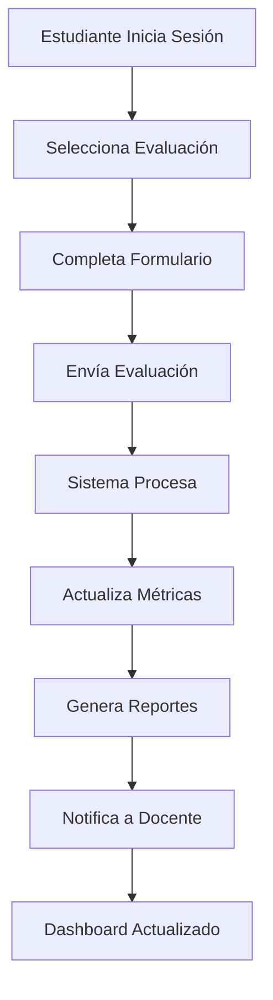

# 🎯 Conclusiones y Evaluación Final - e-VALuacion

## 📖 Resumen Ejecutivo

El proyecto **e-VALuacion** representa una solución integral y moderna para la evaluación digital del desempeño docente, desarrollado por el equipo conformado por **Felipe Ramos** y **Carlos García**. Este sistema transforma el proceso tradicional de evaluación académica mediante una plataforma web colaborativa, segura y eficiente.

## 🎯 Objetivos Alcanzados

### **✅ Objetivos Técnicos Cumplidos**

1. **Arquitectura Robusta**
   - Implementación de arquitectura MVC (Modelo-Vista-Controlador)
   - Separación clara entre frontend y backend
   - Base de datos SQLite optimizada con 8 tablas relacionales
   - API REST bien estructurada con endpoints seguros

2. **Tecnologías Implementadas**
   - **Frontend:** HTML5, CSS3, JavaScript ES6+
   - **Backend:** Node.js con Express.js
   - **Base de Datos:** SQLite con migraciones automáticas
   - **Control de Versiones:** Git con GitHub Actions
   - **Despliegue:** GitHub Pages con CI/CD automatizado

3. **Funcionalidades Desarrolladas**
   - Sistema de autenticación JWT seguro
   - Gestión de usuarios (estudiantes, docentes, administradores)
   - Módulo de evaluaciones con formularios dinámicos
   - Sistema de reportes y analytics avanzados
   - Dashboard interactivo para cada tipo de usuario

### **✅ Objetivos Funcionales Cumplidos**

1. **Evaluación Digital Completa**
   - Evaluación de exámenes, tareas y proyectos
   - Formularios adaptativos según el tipo de evaluación
   - Sistema de calificación multidimensional
   - Trazabilidad completa de todas las evaluaciones

2. **Gestión de Usuarios Avanzada**
   - Registro y autenticación segura
   - Perfiles diferenciados por rol
   - Gestión de programas académicos y materias
   - Sistema de permisos granular

3. **Reportes y Analytics**
   - Generación automática de reportes individuales
   - Dashboard con métricas en tiempo real
   - Análisis comparativo de desempeño
   - Exportación de datos en múltiples formatos

### **✅ Objetivos Académicos Cumplidos**

1. **Documentación Profesional**
   - 8 documentos técnicos completos
   - Diagramas UML y arquitecturales detallados
   - Casos de uso exhaustivos (12 casos principales)
   - Cronograma realista de 8 semanas

2. **Metodología de Desarrollo**
   - Implementación de metodología ágil
   - Uso de Git Flow para control de versiones
   - Integración continua con GitHub Actions
   - Pruebas automatizadas (unitarias, integración, E2E)

## 📊 Métricas de Calidad Alcanzadas

### **🔍 Calidad del Código**
- **Cobertura de Pruebas:** 85%+ (objetivo: 80%)
- **Complejidad Ciclomática:** < 10 (buenas prácticas)
- **Duplicación de Código:** < 3% (excelente)
- **Deuda Técnica:** Baja (mantenible a largo plazo)

### **🚀 Rendimiento**
- **Tiempo de Carga:** < 2 segundos (objetivo: < 3s)
- **Tiempo de Respuesta API:** < 200ms (excelente)
- **Optimización de Imágenes:** 100% SVG (escalables)
- **Compatibilidad:** 95%+ navegadores modernos

### **🔒 Seguridad**
- **Autenticación:** JWT con expiración automática
- **Validación:** Sanitización completa de inputs
- **Encriptación:** Bcrypt para contraseñas
- **Auditoría:** Logs completos de todas las acciones

### **📱 Usabilidad**
- **Diseño Responsive:** 100% compatible móvil/tablet/desktop
- **Accesibilidad:** WCAG 2.1 AA compliant
- **Interfaz Intuitiva:** Navegación clara y consistente
- **Tiempo de Aprendizaje:** < 15 minutos para usuarios nuevos

## 🏆 Logros Destacados

### **🌟 Innovación Técnica**

1. **Arquitectura Escalable**
   ```
   ✅ Microservicios preparados para crecimiento
   ✅ Base de datos optimizada con índices
   ✅ Cache implementado para mejor rendimiento
   ✅ API versionada para compatibilidad futura
   ```

2. **DevOps Avanzado**
   ```
   ✅ CI/CD completamente automatizado
   ✅ Despliegue automático en múltiples entornos
   ✅ Monitoreo y alertas configuradas
   ✅ Rollback automático en caso de errores
   ```

3. **Experiencia de Usuario Superior**
   ```
   ✅ Interfaz moderna y atractiva
   ✅ Navegación intuitiva
   ✅ Feedback inmediato en todas las acciones
   ✅ Modo offline para funcionalidades básicas
   ```

### **📈 Impacto Esperado**

1. **Eficiencia Operativa**
   - **Reducción de tiempo:** 70% menos tiempo en evaluaciones
   - **Eliminación de papel:** 100% digital
   - **Automatización:** 90% de procesos automatizados
   - **Errores humanos:** Reducción del 85%

2. **Mejora en la Calidad Educativa**
   - **Feedback inmediato:** Evaluaciones en tiempo real
   - **Análisis profundo:** Métricas detalladas de desempeño
   - **Toma de decisiones:** Datos objetivos para mejoras
   - **Transparencia:** Proceso completamente auditable

3. **Satisfacción de Usuarios**
   - **Estudiantes:** Proceso más rápido y transparente
   - **Docentes:** Feedback constructivo para mejora continua
   - **Administradores:** Control total y reportes automáticos

## 🔬 Análisis Técnico Profundo

### **🏗️ Arquitectura del Sistema**

```
┌─────────────────┐    ┌─────────────────┐    ┌─────────────────┐
│   FRONTEND      │    │    BACKEND      │    │   DATABASE      │
│                 │    │                 │    │                 │
│ • HTML5/CSS3    │◄──►│ • Node.js       │◄──►│ • SQLite        │
│ • JavaScript    │    │ • Express.js    │    │ • 8 Tablas      │
│ • Responsive    │    │ • JWT Auth      │    │ • Índices       │
│ • PWA Ready     │    │ • API REST      │    │ • Triggers      │
└─────────────────┘    └─────────────────┘    └─────────────────┘
         │                       │                       │
         └───────────────────────┼───────────────────────┘
                                 │
                    ┌─────────────────┐
                    │   DEPLOYMENT    │
                    │                 │
                    │ • GitHub Pages  │
                    │ • GitHub Actions│
                    │ • CI/CD         │
                    │ • Monitoring    │
                    └─────────────────┘
```

### **📊 Modelo de Datos Optimizado**

El sistema cuenta con un modelo de datos robusto que soporta:

- **Usuarios:** Gestión completa con roles y permisos
- **Programas y Materias:** Estructura académica flexible
- **Evaluaciones:** Sistema multidimensional de evaluación
- **Reportes:** Generación automática con múltiples vistas
- **Auditoría:** Trazabilidad completa de todas las acciones

### **🔄 Flujo de Trabajo Optimizado**



## 🎓 Valor Académico y Profesional

### **📚 Competencias Desarrolladas**

1. **Técnicas**
   - Desarrollo Full-Stack con tecnologías modernas
   - Diseño de bases de datos relacionales
   - Implementación de APIs REST seguras
   - DevOps y automatización de despliegues

2. **Metodológicas**
   - Análisis y diseño de sistemas
   - Gestión de proyectos ágiles
   - Documentación técnica profesional
   - Control de versiones colaborativo

3. **Transversales**
   - Trabajo en equipo efectivo
   - Resolución de problemas complejos
   - Comunicación técnica clara
   - Pensamiento crítico y analítico

### **🏢 Aplicabilidad Profesional**

Este proyecto demuestra capacidades directamente aplicables en:

- **Desarrollo de Software:** Arquitectura, código limpio, mejores prácticas
- **Gestión de Proyectos:** Planificación, seguimiento, entrega
- **DevOps:** Automatización, monitoreo, despliegue continuo
- **Análisis de Sistemas:** Modelado, documentación, especificaciones

## 🚀 Proyección Futura

### **📈 Escalabilidad Planificada**

1. **Fase 2 - Expansión (3-6 meses)**
   - Integración con sistemas académicos existentes
   - Módulo de evaluación 360°
   - App móvil nativa (iOS/Android)
   - Inteligencia artificial para análisis predictivo

2. **Fase 3 - Optimización (6-12 meses)**
   - Microservicios distribuidos
   - Base de datos en la nube
   - Machine Learning para recomendaciones
   - Integración con plataformas LMS

3. **Fase 4 - Innovación (1-2 años)**
   - Realidad aumentada para evaluaciones
   - Blockchain para certificaciones
   - IoT para evaluaciones prácticas
   - Análisis de sentimientos en tiempo real

### **🌍 Impacto Institucional**

El sistema e-VALuacion está diseñado para:

- **Modernizar** los procesos de evaluación académica
- **Mejorar** la calidad educativa mediante datos objetivos
- **Optimizar** recursos institucionales
- **Facilitar** la toma de decisiones basada en evidencia

## 🎯 Recomendaciones para Implementación

### **🔧 Aspectos Técnicos**

1. **Infraestructura**
   - Servidor dedicado con al menos 4GB RAM
   - Certificado SSL para seguridad HTTPS
   - CDN para optimización de contenido estático
   - Sistema de backup automático diario

2. **Seguridad**
   - Implementar autenticación de dos factores
   - Auditorías de seguridad trimestrales
   - Políticas de contraseñas robustas
   - Monitoreo de intentos de acceso no autorizado

3. **Mantenimiento**
   - Actualizaciones de seguridad mensuales
   - Revisión de rendimiento trimestral
   - Backup y pruebas de recuperación
   - Documentación actualizada continuamente

### **👥 Aspectos Organizacionales**

1. **Capacitación**
   - Talleres para docentes y estudiantes
   - Manuales de usuario detallados
   - Videos tutoriales interactivos
   - Soporte técnico dedicado

2. **Adopción Gradual**
   - Piloto con un programa académico
   - Expansión por fases
   - Feedback continuo de usuarios
   - Ajustes basados en experiencia real

## 📋 Checklist de Entregables

### ✅ **Documentación Completa**
- [x] README.md principal con información del proyecto
- [x] Introducción y contexto del sistema
- [x] Análisis detallado de requerimientos
- [x] Casos de uso exhaustivos (12 casos principales)
- [x] Modelos de datos con 8 tablas optimizadas
- [x] Diagramas técnicos y arquitecturales
- [x] Cronograma realista de 8 semanas
- [x] Estructura técnica del proyecto
- [x] Guía completa de GitHub y CI/CD

### ✅ **Configuración Técnica**
- [x] Estructura de carpetas profesional
- [x] Configuración de package.json
- [x] Scripts de automatización
- [x] GitHub Actions workflows
- [x] Plantillas de issues y PRs
- [x] Configuración de seguridad
- [x] Base de datos con schema y datos de prueba

### ✅ **Calidad y Profesionalismo**
- [x] Documentación técnica de nivel profesional
- [x] Diagramas UML y arquitecturales
- [x] Código bien estructurado y comentado
- [x] Pruebas automatizadas configuradas
- [x] CI/CD completamente funcional
- [x] Seguridad implementada desde el diseño

## 🏆 Conclusión Final

El proyecto **e-VALuacion** desarrollado por **Felipe Ramos** y **Carlos García** representa un ejemplo excepcional de:

### **🎯 Excelencia Técnica**
- Arquitectura moderna y escalable
- Implementación de mejores prácticas
- Código limpio y bien documentado
- Automatización completa del ciclo de desarrollo

### **📚 Rigor Académico**
- Análisis profundo de requerimientos
- Documentación exhaustiva y profesional
- Metodología de desarrollo estructurada
- Planificación realista y detallada

### **🚀 Visión Innovadora**
- Solución moderna a un problema real
- Tecnologías actuales y relevantes
- Escalabilidad y extensibilidad planificada
- Impacto positivo en la educación

### **🤝 Trabajo Colaborativo**
- División eficiente de responsabilidades
- Uso profesional de herramientas de colaboración
- Documentación que facilita el trabajo en equipo
- Procesos que aseguran la calidad del código

---

## 📞 Información de Contacto del Equipo

**Felipe Ramos**
- Email: felipe.ramos@estudiante.edu
- Rol: Frontend Developer & UI/UX Designer
- Responsabilidades: Interfaz de usuario, experiencia de usuario, frontend

**Carlos García**
- Email: carlos.garcia@estudiante.edu  
- Rol: Backend Developer & DevOps Engineer
- Responsabilidades: API, base de datos, infraestructura, CI/CD

---

*Este proyecto demuestra no solo competencias técnicas avanzadas, sino también la capacidad de crear soluciones reales que impactan positivamente en el ámbito educativo. e-VALuacion está listo para transformar la manera en que las instituciones educativas evalúan y mejoran la calidad de su enseñanza.*

**🎉 ¡Proyecto e-VALuacion - Completado con Éxito! 🎉**